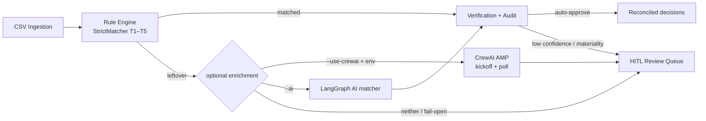

# Architecture — reconq-core

Extracted AR cash-application pipeline from ReconQ.

## Pipeline



Text form:

```
ingestion (CSV)
  → rule engine (exact / fuzzy deterministic)
  → optional leftover enrichment:
        CrewAI AMP (--use-crewai + CREWAI_API_URL + CREWAI_BEARER_TOKEN)
     or LangGraph AI matcher (--ai)
     or plain unmatched queue
  → verification gate (tolerance, cross-customer, confidence)
  → audit log (treatment + reperformance trail)
  → HITL exception queue (pending items)
```

**Judges / local demo:** the full core pipeline runs with **no CrewAI credentials**.
Default CLI (`scripts/run_pipeline.py`) never attempts AMP unless `--use-crewai` is passed
**and** both env vars are set. Missing/unreachable AMP fails open and leaves StrictMatcher
results intact.

## Optional CrewAI AMP enrichment

Single client: `src/agents/crewai_client.py` (env-gated). Do not add a second secret path.

| Env var | Role |
|---------|------|
| `CREWAI_API_URL` | AMP base URL (placeholder in `.env.example`) |
| `CREWAI_BEARER_TOKEN` | Bearer token for AMP |
| `CREWAI_USER_BEARER_TOKEN` | Optional user-scoped token |

**AMP contract**

1. `POST {CREWAI_API_URL}/kickoff` with JSON body `{"inputs": {...}}` → `{"kickoff_id": "..."}`
2. Poll `GET {CREWAI_API_URL}/status/{kickoff_id}` until terminal state (or timeout)

Typical inputs for this deployment: `user_request`, `ar_ap_mode`, `bank_csv_path`,
`payment_processor_csv_path`, `ground_truth_csv_path`.

Runs can take minutes; the client uses kickoff + poll (not a single blocking HTTP wait).
Any timeout / 404 / 5xx / bad JSON is logged; enrichment returns empty suggestions and
the pipeline continues (fail-open).

CLI:

```bash
python scripts/run_pipeline.py --invoices ... --payments ... --use-crewai
```

## Module map

| Stage | Package | Key symbols |
|-------|---------|-------------|
| Ingestion | `src/ingestion/csv_loader.py` | `parse_invoice_csv`, `parse_payment_csv` |
| Rule engine | `src/rule_engine/strict_matcher.py` | `StrictMatcher` |
| Name similarity | `src/rule_engine/name_matching.py` | `name_similarity`, `is_same_customer` |
| AI / graph | `src/ai_matcher/nodes.py`, `graph.py` | LangGraph nodes (adapted from ReconQ) |
| Optional AMP | `src/agents/crewai_client.py` | `CrewAIClient`, `enrich_leftovers_with_crewai` |
| LLM | `src/llm/mock_provider.py` | `MockProvider` via `get_llm_provider()` |
| Verification | `src/verification/balance_check.py` | `validate_balanced_entry` |
| HITL | `src/verification/review_gate.py` | `ReviewQueue` |
| Audit | `src/audit/disposition.py`, `decision_log.py` | `compute_accounting_treatment`, `build_audit_trail` |
| Runner | `src/pipeline.py`, `scripts/run_pipeline.py` | `run_pipeline()` |

## Decision order (deterministic-first)

1. Exact reference match (T1 / rule node)
2. Exact amount + exact / fuzzy customer name (T2–T3)
3. Reference-in-narration / MatchMemory (T4–T5) → usually HITL
4. Optional leftover enrichment: CrewAI AMP (`--use-crewai`) and/or LangGraph (`--ai`)
5. Verification: cross-customer block, over-allocation clamp, confidence thresholds
6. Audit stamp: accounting treatment + reperformance text — **LLM / AMP never mutates balances**

## Single-tenant note

Multi-entity `entity_guard` checks from the full platform are stubbed as always-pass in this extract. Re-introduce legal-entity isolation before any multi-entity production use.

## Out of scope

PO matching, credit notes, advances, suspense GL, Temporal, PDF OCR, SaaS auth — see README.
